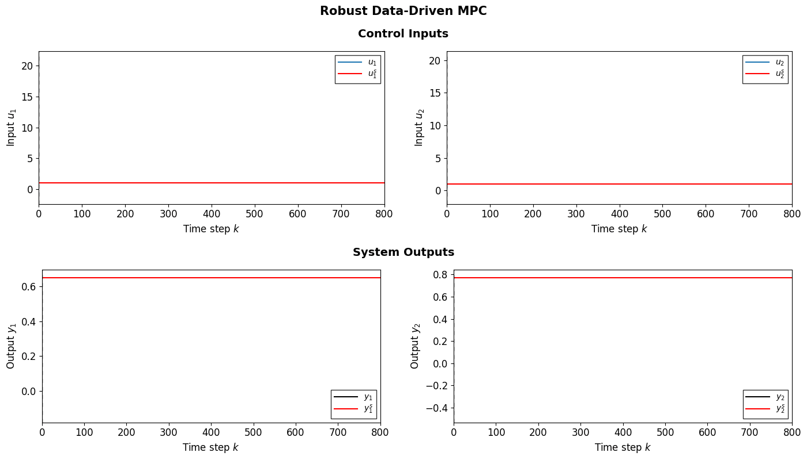
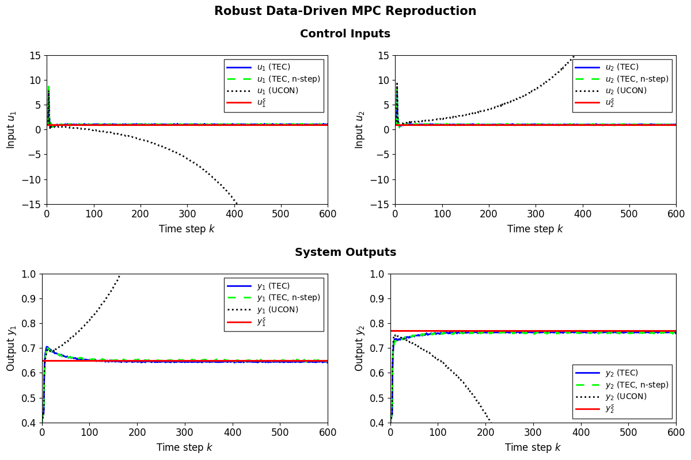

# Direct Data-Driven Model Predictive Control (MPC)


This repository provides a Python implementation of a Direct Data-Driven Model Predictive Control (MPC) controller for Linear Time-Invariant (LTI) systems based on the Nominal and Robust Data-Driven MPC schemes presented in the paper ["Data-Driven Model Predictive Control With Stability and Robustness Guarantees"](https://arxiv.org/abs/1906.04679) by J. Berberich et al.

A **direct data-driven controller** maps measured input-output data from an unknown system *directly* onto the controller without requiring an explicit system identification step. This approach is particularly useful in applications where the system dynamics are too complex to be modeled accurately or where traditional system identification methods are impractical or difficult to apply.

---
***Disclaimer:** This is not the official paper implementation, but an independent project based on the paper.*

---


## Table of Contents
- [Requirements](#requirements)
- [Installation](#installation)
- [Usage](#usage)
- [Paper Reproduction](#paper-reproduction)
- [Code Structure](#code-structure)
  - [Direct Data-Driven MPC Controller](#direct-data-driven-mpc-controller)
  - [Simulation](#simulation)
  - [Visualization](#visualization-static-and-animated-plots)
  - [Examples](#examples)
  - [Configuration Files](#configuration-files)
- [License](#license)
- [Citation](#citation)

## Requirements
This package requires the following:
- **Python** (>=3.8, <3.13). Python 3.13 is not fully supported, as some dependencies have not been compiled for this version yet. We recommend using Python 3.8 to 3.12.
- **FFmpeg**: Required for saving animations (e.g., GIF or MP4).
    - **On Windows**: You can download FFmpeg from [the official FFmpeg website](https://ffmpeg.org/download.html). Ensure it's correctly added to your system's `PATH`.
    - **On Unix**: You can install it using your package manager. For Debian/Ubuntu:
        ```bash
        sudo apt install ffmpeg
        ```
    Verify the installation by running this command:
    ```bash
    ffmpeg -version
    ```

## Installation
Follow these steps to create a virtual environment and install this package:

> [!NOTE]
> On some Unix-based systems (like Ubuntu/Debian), you may need to install `venv` manually if it's not included with Python:
> - **On Ubuntu/Debian**: `sudo apt install python3-venv`
> - **On macOS** and **Windows**: `venv` should be included with Python 3 by default. Make sure to check if Python is installed correctly.

1. Clone this repository.
   ```bash
   git clone https://github.com/pavelacamposp/direct_data_driven_mpc.git
   ```
2. Navigate to the project directory: 
   ```bash
   cd direct_data_driven_mpc
   ```
3. Create a virtual environment in the project directory:
    - Unix/macOS:
        ```bash
        python3 -m venv venv
        ```
    - Windows:
        ```cmd
        python -m venv venv
        ```
4. Activate the virtual environment:
    - Unix/macOS:
        ```bash
        source venv/bin/activate
        ```
    - Windows:
        ```cmd
        venv\Scripts\activate
        ```
5. Install `direct_data_driven_mpc` (Data-Driven MPC controller package):
    ```bash
    pip install -e .
    ```

## Usage
The example script `direct_data_driven_mpc_example.py` demonstrates the setup, simulation, and data visualization of the Data-Driven MPC controller applied to a system.

To run the example script with a `seed` of `0`, simulation length of `400` steps, and save the generated animation to a file, use the following command:
```bash
python examples/direct_data_driven_mpc_example.py --seed 0 --t_sim 400 --save_anim
```
> [!NOTE]
> The `--save_anim` flag requires FFmpeg to be installed. See the [Requirements](#requirements) section for more details.

Some key arguments are listed below:
Argument | Type | Description
--- | --- | ---
`--model_config_path` | `str` | Path to the YAML file containing the model parameters.
`--controller_config_path` | `str` | Path to the YAML file containing the Data-Driven MPC controller parameters.
`--t_sim` | `int` | Simulation length in time steps.
`--save_anim` | `flag` | If passed, saves the generated animation to a file using FFmpeg.
`--anim_path` | `str` | Path where the generated animation file will be saved. Includes the file name and its extension (e.g., `data-driven_mpc_sim.gif`).
`--verbose` | `int` | Verbosity level: `0` = no output, `1` = minimal output, `2` = detailed output.

To use different controller and system parameters, the configuration files in `examples/config` can be modified. Alternatively, different configuration files can be passed using parsing arguments for both the controller (`--controller_config_path`) and the system (`--model_config_path`).

To get the full list of arguments, run the program with the `--help` flag:
```bash
python examples/direct_data_driven_mpc_example.py --help
```

For a deeper understanding of the project and how the controller operates, we recommend reading through the script and the docstrings of each utility function and class used. These docstrings include detailed descriptions of how the implementation follows the data-driven MPC controller schemes and algorithms described in the referenced paper.

## Paper Reproduction
A reproduction script of the paper's results is implemented in `robust_data_driven_mpc_reproduction.py` to validate our implementation. This script closely follows the example presented in Section V of the paper, which demonstrates various Robust Data-Driven MPC controller schemes applied to a four-tank system model.

To run the reproduction script, execute the following command:
```bash
python examples/robust_data_driven_mpc_reproduction.py
```
The figure below shows the expected output from executing this script. The control output graphs from our results closely resemble those shown in Fig. 2 of the paper, with minor differences due to randomization.




## Code Structure

### Direct Data-Driven MPC Controller
The project is structured as a Python package, encapsulating the **Data-Driven Model Predictive Control (MPC)** controller logic within the `DirectDataDrivenMPCController` class. This class implements a controller based on the **Nominal** and **Robust** Data-Driven MPC schemes described in the paper, ensuring that the stability and robustness guarantees are maintained by validating that the controller parameters satisfy the required assumptions and conditions.
- [`direct_data_driven_mpc/direct_data_driven_mpc_controller.py`](direct_data_driven_mpc/direct_data_driven_mpc_controller.py): Implements the main Data-Driven MPC controller in the `DirectDataDrivenMPCController` class.
- [`direct_data_driven_mpc/utilities/hankel_matrix.py`](direct_data_driven_mpc/utilities/hankel_matrix.py): Provides functions for constructing Hankel matrices and evaluating whether data sequences are persistently exciting of a given order.

### Simulation
The `LTIModel` class is implemented to simulate Linear Time-Invariant (LTI) systems, and the `LTISystemModel` class to create `LTIModel` instances using system parameters from YAML configuration files.
- [`utilities/model_simulation.py`](utilities/model_simulation.py): Implements the `LTIModel` and `LTISystemModel` classes.
- [`utilities/initial_state_estimation.py`](utilities/initial_state_estimation.py): Provides functions to estimate the initial state of an LTI model and calculate its equilibrium input-output pairs. These functions are integrated into `LTIModel` and are used for reproducing the paper's results.

### Visualization (Static and Animated Plots)
Custom functions are implemented in [`utilities/visualization/data_visualization.py`](utilities/visualization/data_visualization.py) to display input-output data in static and animated plots. These functions use Matplotlib for visualization and FFmpeg for saving animations in various formats (e.g., GIF, MP4).

### Examples
The `examples` directory includes scripts to demonstrate the operation of the Data-Driven MPC controller and reproduce the results presented in the paper.
- [`examples/direct_data_driven_mpc_example.py`](examples/direct_data_driven_mpc_example.py): Demonstrates the setup, simulation, and data visualization of a Direct Data-Driven MPC controller applied to a system.
- [`examples/robust_data_driven_mpc_reproduction.py`](examples/robust_data_driven_mpc_reproduction.py): Implements a reproduction of the example presented in the paper.

To modularize the controller creation and operation, the following utility modules are used:
- [`utilities/controller/controller_creation.py`](utilities/controller/controller_creation.py): Provides functions for loading controller parameters from YAML configuration files and creating controller instances.
- [`utilities/controller/controller_operation.py`](utilities/controller/controller_operation.py): Manages the model simulation for a typical Data-Driven MPC controller operation, such as randomizing the system's initial state, generating input-output data, and simulating the controller's closed-loop.
- [`utilities/reproduction/paper_reproduction.py`](utilities/reproduction/paper_reproduction.py): Extends the controller creation and operation utility modules to implement the reproduction script.

### Configuration Files
The system and controller parameters used in the example and reproduction scripts are defined in YAML configuration files in the `examples/config` directory. These parameters are based on the example in Section V of the paper.
- [`examples/config/controllers/data_driven_mpc_example_params.yaml`](examples/config/controllers/data_driven_mpc_example_params.yaml): Defines Data-Driven MPC controller parameters.
- [`examples/config/models/four_tank_system_params.yaml`](examples/config/models/four_tank_system_params.yaml): Contains the system model parameters of a linearized version of a four-tank system.

A YAML loading function is provided in  [`utilities/yaml_config_loading.py`](utilities/yaml_config_loading.py).

## License
This project is licensed under the MIT License. See the [LICENSE](LICENSE) file for details.

## Citation
If you use this implementation in your research, please cite the original paper as follows:

### Plain text citation:
J. Berberich, J. Köhler, M. A. Müller and F. Allgöwer, "Data-Driven Model Predictive Control With Stability and Robustness Guarantees," in IEEE Transactions on Automatic Control, vol. 66, no. 4, pp. 1702-1717, April 2021, doi: 10.1109/TAC.2020.3000182.

### BibTeX entry:
```bibtex
@article{Berberich_2021,
   title={Data-Driven Model Predictive Control With Stability and Robustness Guarantees},
   volume={66},
   ISSN={2334-3303},
   url={http://dx.doi.org/10.1109/TAC.2020.3000182},
   DOI={10.1109/tac.2020.3000182},
   number={4},
   journal={IEEE Transactions on Automatic Control},
   publisher={Institute of Electrical and Electronics Engineers (IEEE)},
   author={Berberich, Julian and Kohler, Johannes and Muller, Matthias A. and Allgower, Frank},
   year={2021},
   month=apr, pages={1702–1717}}
```